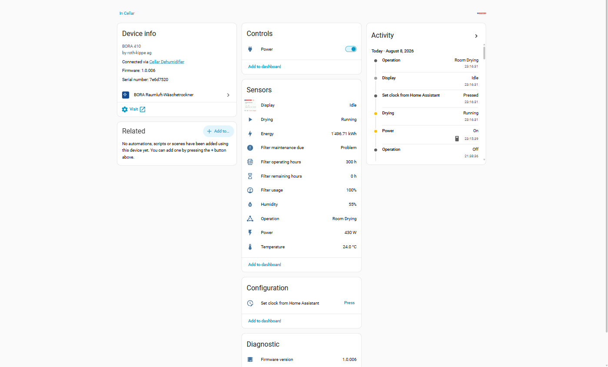

  

<h1 align="center">Roth-Kippe BORA — Home Assistant integration</h1>

<em>Your BORA laundry dryer, on your dashboard.</em>

  
  
  
  
  
  
  
  
  

  
  &nbsp;·&nbsp;
  <a href="https://github.com/chriguschneider/hass-bora-dryer/issues">Issues</a>
  &nbsp;·&nbsp;
  <a href="PETITION.md">Petition for an open API</a>

A local-polling Home Assistant integration for the **Roth-Kippe BORA 4xx**
[Raumluft-Wäschetrockner](https://www.roth-kippe.ch/waeschetrockner) — Swiss-made
heat-pump room-air laundry dryers. It reads the dryer's built-in WLAN status
page and surfaces every value as a proper Home Assistant entity, grouped under
one device — so drying state, temperature, humidity and filter wear live on your
dashboard instead of on the machine's display in the basement.

  

<b>Table of contents</b>

- [What this integration does](#what-this-integration-does)
- [Entities](#entities)
- [What it does *not* do (and why)](#what-it-does-not-do-and-why)
- [Installation](#installation)
- [Configuration](#configuration)
- [Security note](#security-note)
- [Supported models](#supported-models)
- [Help us get an open interface](#help-us-get-an-open-interface)
- [AI-assisted development](#ai-assisted-development)
- [Community](#community)
- [Changelog](#changelog)
- [License](#license)

## What this integration does

The BORA runs a small, read-only HTTP status server on your WLAN. On its own
that server is only useful if you happen to open a browser and type in the
dryer's IP. This integration polls it every 60 seconds and turns it into
first-class Home Assistant entities, so you can:

- **See at a glance whether it's running** — `Drying` is a binary sensor you can
  put on any dashboard, drive a notification from ("laundry's done"), or gate an
  automation on.
- **Track filter wear** — operating hours, remaining hours, a usage percentage,
  and a maintenance reminder that fires *once* when the filter is due and clears
  itself when you reset it on the machine. No more guessing.
- **Watch the room climate** — the BORA's own temperature and humidity readings,
  with optional fallback to an external sensor while the dryer is powered down.
- **Mirror the LCD** — a `Display` camera entity shows the machine's current
  screen right in Home Assistant.
- **Unify power & energy** — point the integration at the smart plug in front of
  the dryer and its power/energy readings appear under the same device.

Everything is local. No cloud, no account, no polling of a vendor server.

## Entities

All entities are grouped under a single **BORA** device.

| Entity | Type | Notes |
|---|---|---|
| Operation | `sensor` | Text state: `Standby`, `Drying`, … |
| Drying | `binary_sensor` | `on` while the operation state contains `Drying` |
| Temperature | `sensor` | °C, room/intake temperature (optional external fallback when the BORA is offline) |
| Humidity | `sensor` | %, relative humidity (optional external fallback when the BORA is offline) |
| Filter operating hours | `sensor` | Hours since the last filter reset |
| Filter remaining hours | `sensor` | Hours left until the maintenance threshold |
| Filter usage | `sensor` | % of the filter interval consumed |
| Filter maintenance due | `binary_sensor` | `on` when filter hours ≥ threshold (default 280; the machine warns at 300) |
| Firmware version | `sensor` (diagnostic) | e.g. `V1.0.006` |
| Display | `camera` | Live snapshot of the BORA's LCD |
| Set clock from Home Assistant | `button` | Pushes HA's time to the dryer's clock |
| Power | `switch` | Wraps the upstream smart plug (optional) |
| Power / Energy | `sensor` | Mirrored from the upstream smart plug (optional) |

## What it does *not* do (and why)

**The BORA offers no remote control of the drying itself.** You cannot start or
stop a program, pick a cycle, or change a parameter over the network — the
manufacturer built the WLAN interface as a status mirror, and the *only* write
operation it exposes is setting the clock (used by the `Set clock` button).

The `Power` switch in the table above does **not** talk to the dryer's
controller — it toggles a smart plug you place in front of the machine (e.g. a
Shelly PM). That's the honest state of the art today, and it's exactly what the
[petition](#help-us-get-an-open-interface) below is trying to change.

## Installation

### HACS (custom repository)

**One-click:** 

Or manually:

1. In HACS, open **⋮ → Custom repositories**.
2. Add `https://github.com/chriguschneider/hass-bora-dryer` with category
   **Integration**.
3. Install **BORA Raumluft-Wäschetrockner** and **restart Home Assistant**.
4. Go to **Settings → Devices & Services → Add Integration → BORA
   Raumluft-Wäschetrockner** and enter the IP address of your BORA.

> 💡 Give the BORA a static IP (DHCP reservation) in your router so the
> integration keeps finding it after a reboot.

## Configuration

Setup only asks for the dryer's host/IP. Everything else lives in the
integration's **Configure** dialog (optional):

- **Power switch entity** — a smart plug in front of the dryer; adds the `Power`
  switch on the BORA device.
- **Power / Energy sensors** — mirror the plug's readings under the BORA device
  for unified history and dashboards.
- **Temperature / Humidity fallback sensors** — used while the BORA itself is
  offline, so those readings stay available when the machine is powered down.
- **Filter maintenance threshold (hours)** — when the reminder fires (default
  280).
- **Show filter maintenance notification** — turn the persistent reminder on/off.

## Security note

⚠️ **The BORA web interface has no authentication.** Anyone on the same network
can view its status, change the device clock, upload firmware, and **read the
WLAN password in plaintext** on the WiFi configuration page. This is a vendor
design choice, not a configuration issue.

**Recommendation:** put the BORA in an isolated IoT VLAN, or otherwise restrict
which hosts on your LAN can reach it.

## Supported models

Tested on the **BORA 410** (firmware `V1.0.006`). It very likely works across
the whole **BORA 4xx** series (408 / 410 / 415 / 420), which share the same
controller. Running a different model? Please
[open an issue](https://github.com/chriguschneider/hass-bora-dryer/issues/new)
with the contents of `http://<your-bora-ip>/info.html` so it can be confirmed.

## Help us get an open interface

This integration can only *read* the dryer, because that's all Roth-Kippe
currently allows over the network. A documented local control API — start/stop,
program selection, filter reset — would let the BORA do what a modern appliance
should: start on solar surplus, pause on a time-of-use tariff, and reset its
filter counter without a trip to the basement.

**If you own a BORA, add your voice:** a 👍 on the pinned
**[petition issue](https://github.com/chriguschneider/hass-bora-dryer/issues/4)**
is one more owner telling Roth-Kippe that an open interface matters. Background
and the full open letter are in **[PETITION.md](PETITION.md)**. The more owners
sign, the stronger the case.

## AI-assisted development

This integration is built by Chrigu & Claude — a human and an LLM working
together. The reverse-engineering of the BORA's HTTP interface, the "what should
each entity actually mean?" calls, and every design trade-off are mine. A large
share of the typing, the Home Assistant boilerplate, and the test scaffolding
was done by [Claude Code](https://claude.com/claude-code). Every line is reviewed
and shipped consciously — the badge is here because being transparent about how
software is made matters more than pretending otherwise.

If this earned a spot on your dashboard,
[buying me a coffee](https://buymeacoffee.com/chriguschneider) is the nicest way
to say thanks ❤️

## Community

- 🐛 **Found a bug or want a feature?**
  [Open an issue](https://github.com/chriguschneider/hass-bora-dryer/issues/new).
- 📣 **Own a BORA?** Sign the [petition](PETITION.md) for an open control API.
- 💬 **Using it?** The Home Assistant community thread is the place to share
  screenshots and setups (link in the repo description).

## Changelog

Version history

- **v0.7.0** — Filter maintenance now surfaces as a **persistent notification**
  instead of a repair issue under Settings → System → Repairs. A filter reminder
  is real-world appliance maintenance, not a Home Assistant health problem, so
  the notification panel is the idiomatic channel (mirroring how the Dreame
  vacuum integration handles consumables). It self-clears once the filter is
  reset on the device and can be turned off with the new *Show filter maintenance
  notification* option. Dismissing it acknowledges the reminder — it stays gone
  until the counter climbs over the threshold again, so it never re-nags on every
  poll. Any leftover repair issue from earlier versions is removed on upgrade.
- **v0.6.0** — Optional temperature and humidity fallback sensors. Pick an
  external sensor in the options and the BORA's `Temperature` / `Humidity`
  entities keep reporting from that source while the BORA is offline; its own
  readings are used when it's online.
- **v0.5.1** — When the device is unreachable, `Operation` reports `Off` and
  `Drying` reports `false` instead of freezing on the last value — no more stuck
  `Drying` readings when power is cut mid-cycle. Filter and firmware sensors keep
  their last value (still factually correct when offline).
- **v0.5.0** — Filter, firmware, operation and drying sensors retain their last
  successful value while the device is unreachable instead of going
  `unavailable`. Temperature and humidity still go `unavailable`, since a stale
  reading would mislead. Closes
  [#2](https://github.com/chriguschneider/hass-bora-dryer/issues/2).
- **v0.4.0** — Built-in filter-maintenance reminder when operating hours exceed
  the threshold; clears automatically once the filter is reset. Removes the need
  for an external YAML automation. (Originally a repair issue; changed to a
  persistent notification in v0.7.0.)
- **v0.3.2** — Setup tolerates an offline device; entities register as
  `unavailable` instead of failing to load. Closes
  [#1](https://github.com/chriguschneider/hass-bora-dryer/issues/1).
- **v0.3.1** — Optional power & energy mirror sensors from the upstream smart
  plug.
- **v0.3.0** — BORA device shown as *connected via* the upstream power switch
  device once configured.
- **v0.2.0** — Live LCD camera, set-clock button, options flow with power-switch
  wrapper and configurable filter-due threshold, derived filter-remaining and
  filter-progress sensors.
- **v0.1.0** — Initial release: status sensors, drying & filter-due binary
  sensors.

## License

Released under the [MIT license](LICENSE).
